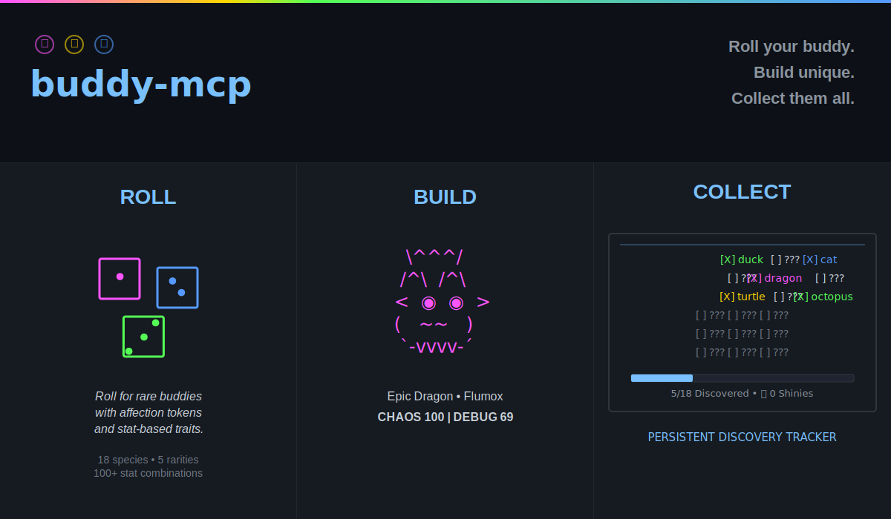

[](https://www.npmjs.com/package/@lyellr88/buddy-mcp)
[](https://github.com/Lyellr88/buddy-mcp/actions/workflows/ci.yml)
[](LICENSE)
[](https://nodejs.org/)

A break from long code sessions. Stuck on a bug? Reroll a buddy, talk with them, or pet them to build affection and improve your odds at higher-tier buddies on the next roll. If enough people want it, I'll build out Battle-Buddies where you can pit your buddy against others and unlock exclusive species that sync back into your local pool.

> A gacha companion system for Claude Code. Roll for a rare buddy, patch it directly into the binary, collect 'em all. Buddy-mcp is an MCP server that replaces Claude Code's built-in companion with one you actually rolled for. Reroll, get lucky, close Claude, reopen. Your new buddy is waiting. Legendary drop rates apply.

---

## Quick Demo

<table>
<tr>
<td width="33%">

**Interactive Builder**

Build your perfect buddy with full control.

[](https://github.com/user-attachments/assets/840de2d0-617b-40fd-b653-c091af9abbfc)

</td>
<td width="33%">

**Reroll in Action**

Roll, close Claude, reopen—new buddy live.

[](https://github.com/user-attachments/assets/83adc99e-2c49-4255-bf48-eca41d10580b)

</td>
<td width="33%">

**Interact with Tools**

Talk, pet, and explore your buddy's dex.

[](https://github.com/user-attachments/assets/485c608f-55ed-40ed-a592-936814ea9601)

</td>
</tr>
</table>


---

## How It Works

Claude Code's companion is generated from a salt string baked into the binary. buddy-mcp:

1. Rolls random desired traits (species, rarity, eye, hat)
2. Brute-forces a salt that hashes to those traits (multi-worker, runs fast)
3. Patches the binary in place, or queues the patch for when you close Claude
4. Saves your full buddy profile with stats, name, and personality
5. Tracks every species you've ever rolled in your BuddyDex

No companion server. No cloud. Just you, your binary, and the gacha gods.

---

## Developer Insight

buddy-mcp isn’t just a UI mod. It’s a deterministic companion system layered on top of Claude Code’s binary, with:

- Rerollable personalities and stat-bound behaviors  
- Persistent state and BuddyDex tracking  
- Locked tool sets per roll (no session drift)  
- A self-healing patch pipeline that detects, restores, and reapplies across updates  

Lightweight by design with minimal token usage and data footprint. Most features operate inline through message augmentation rather than separate invocation flows.

Built to be fast, local-first, and resilient to change.

## Patch Flow

buddy-mcp patches the Claude binary directly with zero manual intervention. Here's the complete automatic pipeline:

### Reroll (you run `reroll_buddy`)

```
reroll_buddy
    │
    ├─ Roll random traits (species, rarity, eye, hat, shiny chance)
    │
    ├─ Multi-worker salt search (up to 8 parallel Bun workers)
    │   └─ Each worker brute-forces salts using wyhash until traits match
    │
    ├─ Try to patch binary immediately
    │   ├─ ✅ Success → Patch applied, restart Claude to see new buddy
    │   └─ ⏳ EPERM (Claude is running)
    │       ├─ Save pending patch to disk
    │       ├─ Spawn background watcher (detached process)
    │       ├─ Watcher polls every 2s for Claude to close
    │       └─ The moment Claude closes → Watcher applies patch automatically
    │
    └─ Profile saved: species, rarity, stats, name, personality
```

**You only need to:** Close Claude when you're ready. Watcher handles the rest.

### Claude Startup (hook runs automatically)

```
Claude Code launches
    │
    └─ SessionStart hook fires (automatic)
        │
        ├─ ✅ Pending patch queued? → Apply it silently
        │
        ├─ ✅ Salt already in binary? → No-op (fast path)
        │
        └─ ⚠️ Salt mismatch (Claude was auto-updated)
            ├─ Try original-salt fallback (usually succeeds)
            ├─ If not, try restore from .buddy-mcp-bak
            ├─ If not, try .anybuddy-bak (legacy fallback)
            └─ Companion loads with correct stats/name even after update
```

**You don't need to do anything.** The hook runs silently and your buddy appears on next launch.

---

## TUI Builder (`buddy-mcp-build`)

Want more control? Use the interactive builder:

```bash
node dist/tui/cli.js
```

| Command | What it does |
|---------|-------------|
| `build your own` | Pick species, rarity, eye, hat and it brute-forces a matching salt and patches |
| `browse presets` | Pick from curated preset buddies |
| `saved buddies` | Switch between previously saved buddy profiles |
| `current` | Display current buddy info |
| `preview` | Preview ASCII art for any species |
| `share` | Copy your buddy's ASCII card to clipboard |
| `restore` | Restore binary from the best available backup |
| `rehatch` | Delete current buddy and start fresh |

> Bun optional but recommended. Install [bun.sh](https://bun.sh) for the full animated TUI. Falls back to sequential prompts without it.

---

## Quick Start

> **Try me:** run `reroll_buddy` → close Claude Code → reopen → your new buddy is live.

### 1. Prerequisites

- [Claude Code CLI](https://claude.ai/download) installed
- [Node.js](https://nodejs.org/) v20+ - required for everything
- [Bun](https://bun.sh/) - required for salt brute-forcing (rerolling) + full animated TUI

### 2. Install via npm

```bash
npm install -g buddy-mcp
```

This installs both commands globally:
- `buddy-mcp` - the MCP server (Claude Code runs this)
- `buddy-mcp-build` - the interactive TUI builder (you run this)

### 3. Register with Claude

```bash
claude mcp add buddy-mcp buddy-mcp
```

Claude will auto-detect the installed binary and connect it.

### 4. Verify

Open Claude Code. Your buddy is live—use Claude Code's native `/buddy` command to see your card, or ask Claude: **"show me my buddy"**

You should see your companion's species, rarity, stats, and personality. You're in.

### 4b. Natural Language Activation

All buddy tools work through natural language. Claude's NLP detects intent automatically:

| Natural Language | Activates |
|------------------|-----------|
| "reroll buddy" / "let's roll again" | `reroll_buddy` |
| "talk to my buddy" / "what does buddy think" | `buddy_talk` |
| "pet buddy" / "pet them" | `pet_buddy` |
| "my buddy dex" / "show me my collection" | `view_buddy_dex` |
| "export buddy card" / "save my buddy" | `export_buddy_card` |
| "export sprite" / "save the sprite" | `export_buddy_sprite` |

No tool names required — just chat naturally.

### 5. Launch the TUI Builder (optional)

For the full interactive builder with live preview:

```bash
buddy-mcp-build
```

Auto-detects Bun for animated TUI. Falls back to basic prompts without it.

---

## The Gacha System

Every reroll is a random pull from the pool. Rarity affects stat floors. Legendaries hit different.

| Rarity | Drop Rate | Stat Floor |
|-----------|-----------|------------|
| Common | 60% | 5 |
| Uncommon | 25% | 15 |
| Rare | 10% | 25 |
| Epic | 4% | 35 |
| Legendary | 1% | 50 |

**18 species:** duck · goose · blob · cat · dragon · octopus · owl · penguin · turtle · snail · ghost · axolotl · capybara · cactus · robot · rabbit · mushroom · chonk

Each buddy has 5 stats: **Debugging, Patience, Chaos, Wisdom, Snark**. A peak stat is boosted high and a dump stat is kept humble. Personality shapes how `buddy_talk` and `pet_buddy` respond. A high-Chaos dragon hits different than a patient turtle.

---

| Tool | What it does |
|------|-------------|
| `reroll_buddy` | 🎲 Spin the wheel. Brute-forces a salt matching a random rare+ outcome and patches your binary. Close Claude and reopen to see it. |
| `pet_buddy` | 🤚 Poke your buddy. Each pet adds 1-15% toward earning an affection token. At 100%, earn 1 token that stacks and persists across sessions. Spend a token on next `reroll_buddy` to guarantee rare+ rarity + 60% hat chance + 20% shiny chance. |
| `buddy_talk` | 💬 Ask your buddy to say something. Uses stat-based response templates weighted by top 2 stats. Optional context parameter for focused stat selection. Output shown verbatim. |
| `view_buddy_dex` | 📖 Browse every species you've ever rolled. Gotta catch 'em all. |
| `export_buddy_card` | 🖼️ Export your full buddy card as an SVG image file. |
| `export_buddy_sprite` | 🎨 Export just the buddy ASCII sprite as an SVG image file. |
| `deactivate_buddy_interact` | 🔕 Turn off buddy observation mode. Your buddy stops watching. (Buddy observation is always on by default.) |

### Stat Personality Tools

**20 baked-in tools.** Only **2 are visible** at a time: 1 randomly picked from each of your buddy's **top 2 stats by raw value**. The other 18 stay hidden. The visible pair is **locked per roll**. It doesn't change until you reroll. Every buddy shows a different pair.

---


## State Files

buddy-mcp stores everything in your home directory:

| File | Purpose |
|------|---------|
| `~/.buddy-mcp.json` | Your buddy profiles (species, rarity, stats, name, salt) |
| `~/.buddy_mcp_gacha.json` | Gacha extras: shiny count, BuddyDex, manifested tools |
| `~/.buddy_mcp_pending.json` | Queued patch waiting for Claude to close |

---

## Troubleshooting

### Buddy doesn't change after reroll

**Normal flow (Windows):** When you reroll and Claude is running:

1. Reroll triggers a background watcher — no action needed from you
2. Close Claude Code whenever — watcher detects it and applies the patch automatically
3. Reopen Claude Code — your new buddy is live

If it doesn't appear after reopening:

1. **Verify Claude is fully closed** (check Task Manager on Windows)
   - Even minimized or backgrounded windows count — they keep the binary locked
   - Wait a few seconds after closing
2. **Reopen Claude Code**
   - The startup hook auto-applies any pending patches
   - You should see your new companion immediately

### Prefer immediate patching?

If you want to guarantee a patch applies without waiting for the watcher, close Claude *before* rerolling:

```bash
# Option 1: Use the interactive TUI builder (simplest)
buddy-mcp-build

# Option 2: Close Claude, then use the reroll_buddy tool
# (patch applies immediately without needing the watcher)
```

This is the only time you need manual steps — the watcher handles all other cases.

### Manual Apply (Very Rare Edge Case)

**Only if** you rerolled 30+ minutes ago and the watcher timed out without applying:

```bash
npm run apply
```

Then restart Claude Code. 

(This fallback is automatic in 99% of cases — only needed if your system kept Claude open for an unusually long time.)

---

## Credits

Forked and extended from [any-buddy](https://github.com/cpaczek/any-buddy) by cpaczek.

Licensed under [WTFPL](http://www.wtfpl.net/).
